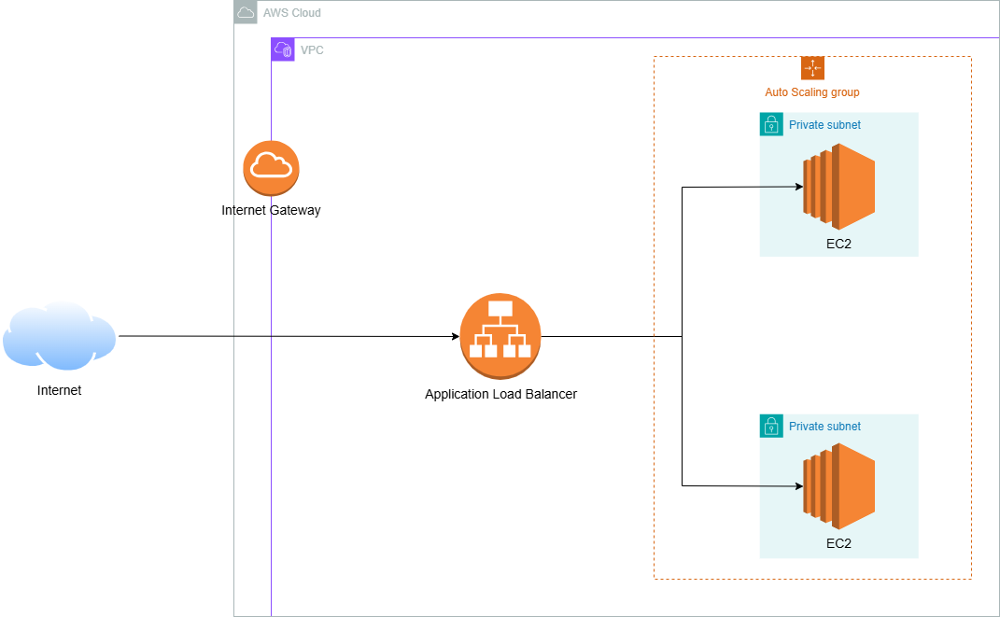

# Golden Owl DevOps Internship - Technical Test
At Golden Owl, we believe in treating infrastructure as code and automating resource provisioning to the fullest extent possible. 

In this technical test, we challenge you to create a robust CI build pipeline using GitHub Actions. You have the freedom to complete this test in your local environment.

## Your Mission 🌟
Your mission, should you choose to accept it, is to craft a CI job that:
1. Forks this repository to your personal GitHub account.
2. Dockerizes a Node.js application.
3. Establishes an automated CI/CD build process using GitHub Actions workflow and a container registry service such as DockerHub or Amazon Elastic Container Registry (ECR) or similar services.
4. Initiates CI tests automatically when changes are pushed to the feature branch on GitHub.
5. Utilizes GitHub Actions for Continuous Deployment (CD) to deploy the application to major cloud providers like AWS EC2, AWS ECS or Google Cloud (please submit the deployment link).
## Nice to have 🎨
We would be genuinely delighted if you could complement your submission with a `visual flow diagram`, illustrating the sequence of tasks you performed, including the implementation of a `load balancer` and `auto scaling` for the deployed application. This additional touch would greatly enhance our understanding and appreciation of your work.

## Solution
Workflow:

The workflow begins when developer pushes a commit to a GitHub repository. This triggers the GitHub Action workflow, which:
- Run unit test by using npm
- Build the Docker image of the application
- Push the image to Amazon Elastic Container Registry (ECR)
- Deploy the updated image to Amazon Elastic Container Service (ECS)

To be honest, I am having some trouble with the ECS deployment and cannot submit the product in time. I apologize for my lack of completion with the test. I will submit the rest of the test today.

## Additional

ALB DNS name: goldenowl-testapp-alb-1856532215.us-east-1.elb.amazonaws.com

Architecture:

